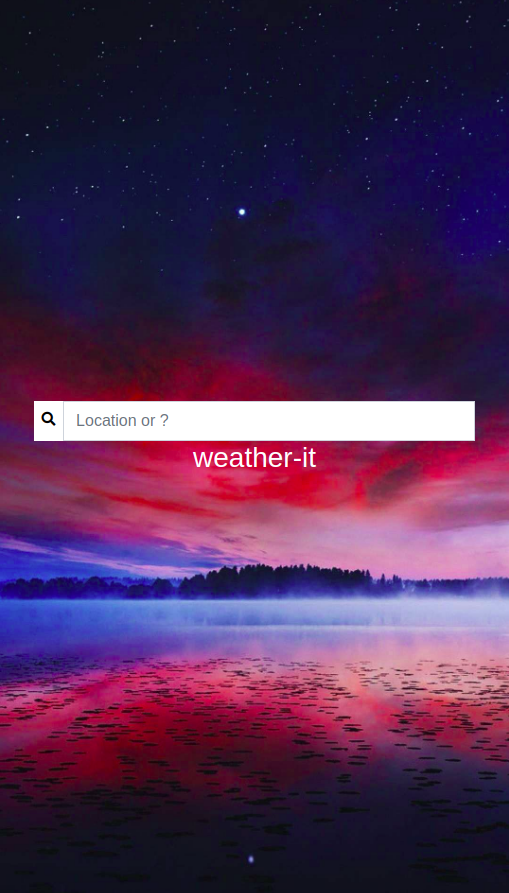
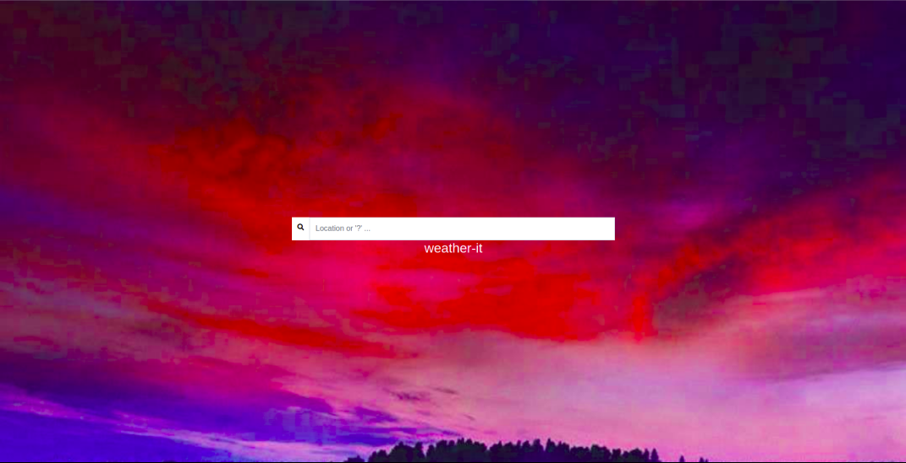
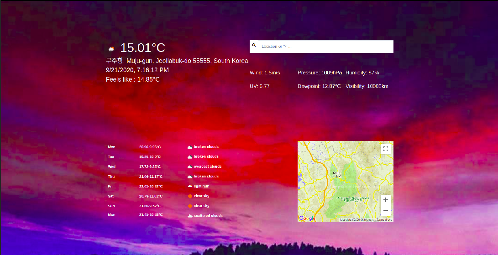

#### **type ? if you want to use geolocation**


##### NOTE
If running on heroku then comment port_no in server/app.js, client/js/index.js and client/js/weather.js.

YOU NEED THREE KEYS TO RUN THE CODE
<br/>
```
        Google Maps JS API key in weather.hbs script link at the end of file in div with id "rendered_map".
        Open Weather key in server/config/config.js
        Mapbox key in server/config/config.js

```


<br>
<br>

<div style="text-align:center">

</div>


<br>
<br>

<div style="text-align:center">

</div>


<br>
<br>

<div style="text-align:center">

</div>


<br>
<br>

